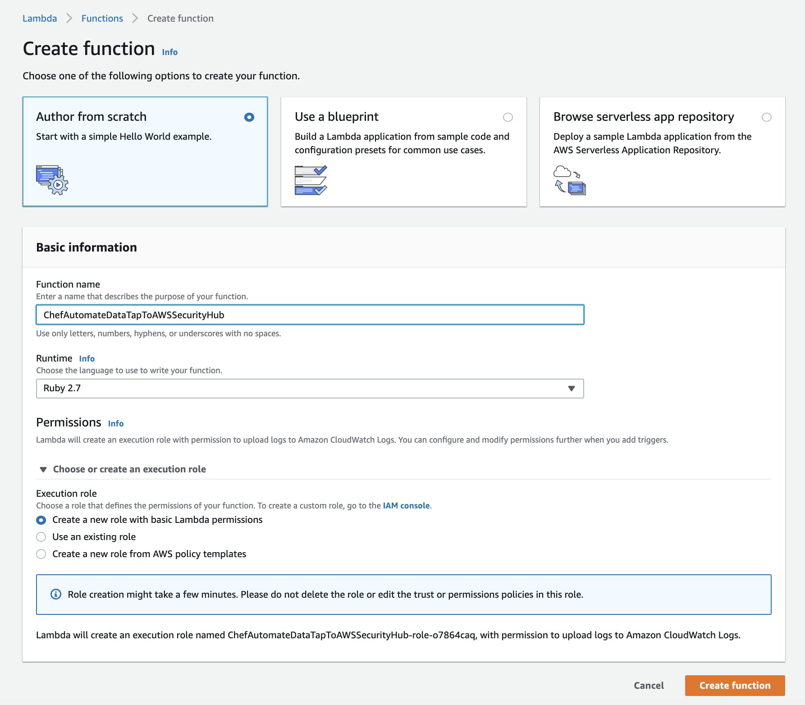
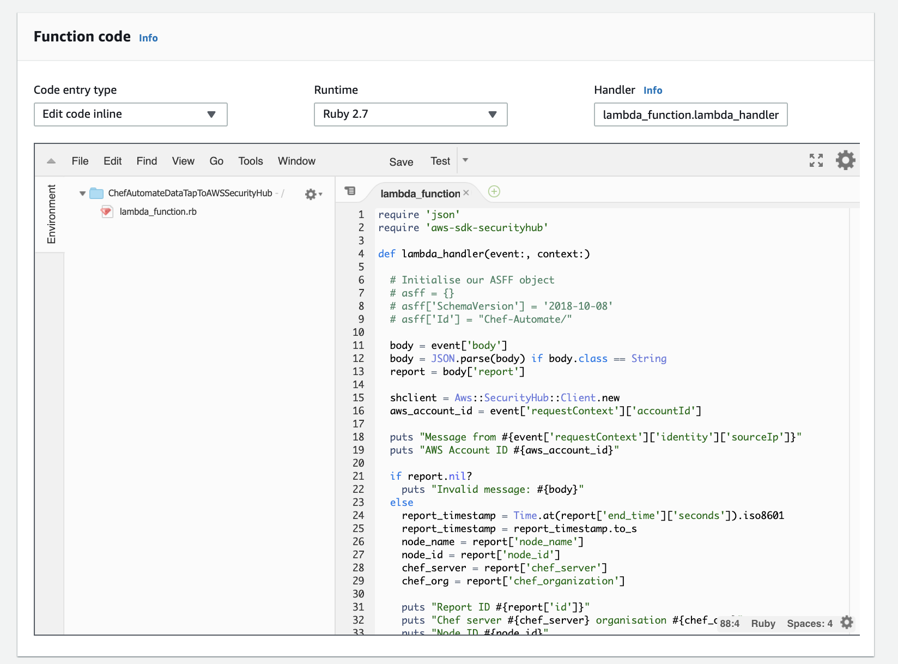
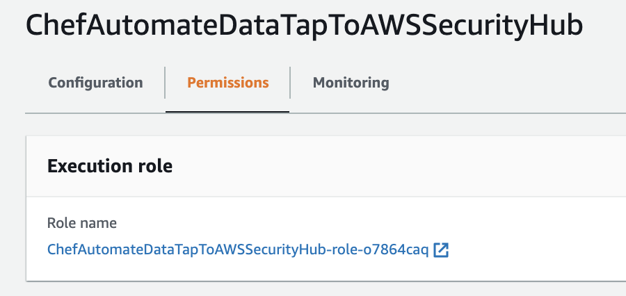
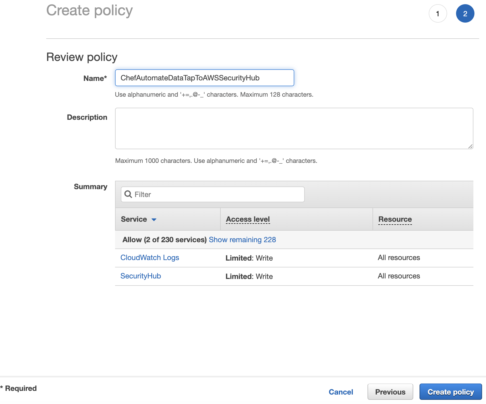
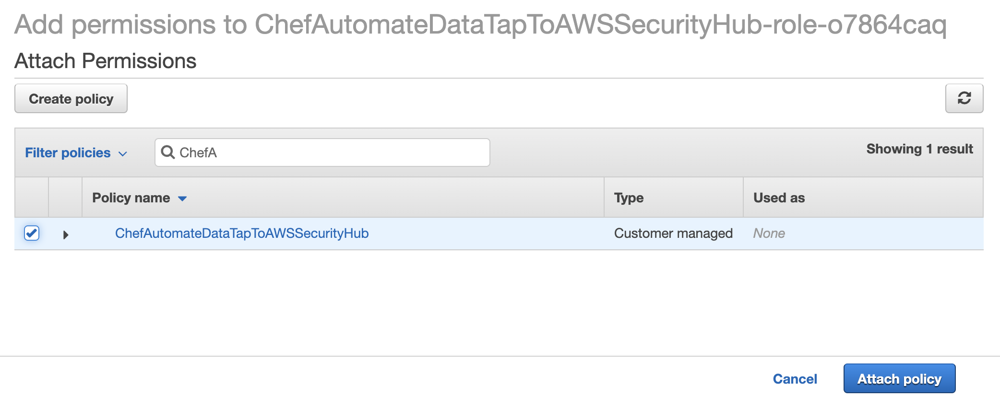

# AwsSecurityHubAutomateIntegration

An AWS Lambda function that sends data received from Chef Automate Data Tap to AWS Security Hub

**Basic flow:<br />**
1. Create an AWS Lambda function with [lambda_function.rb](lambda_function.rb) to process Chef Infrastructure and Compliance Data and send it to the AWS Security Hub in the required [ASFF](https://docs.aws.amazon.com/securityhub/latest/userguide/securityhub-findings-format.html) format.<br />
2. Create an AWS API Gateway and Resouce/Method to connect the Lambda function in (1) to.<br />
3. Add the AWS API Gateway URL to a Chef Automate Data Tap.<br />
4. View the Chef Infrastructure and Compliance Data in the AWS Security Hub.<br />

**Detailed Flow:<br />**
1. Create a new Lambda function as below:<br />
<br />
Save your Lambda function. 

2. Add the Ruby code ([lambda_function.rb](lambda_function.rb)) to the function as below:<br />
<br />

3. Add a Policy to the Lambda's role to allow logging and reporting Findings to the AWS Security Hub.<br />
Click the existing link under `role name`.<br />
<br />
Click `Attach policies` Button, then `Create policy`<br />
<br />
Add the policy below using the json editor<br />
```
{
  "Version": "2012-10-17",
  "Statement": [
     {
       "Effect": "Allow",
       "Action": [
         "logs:CreateLogStream",
         "logs:CreateLogGroup",
         "logs:PutLogEvents",
         "securityhub:BatchImportFindings"
       ],
       "Resource": "*"
     }
   ]
}
```
Click `Review policy`
Click `Create policy`
<br />
Search for your newly created policy attach it to your role<br />
<br />

Install it behind an API gateway and set the calling security appropriately for your environment.
It can be set to run with no authentication, but you SHOULD probably restrict it to just your A2 server.

## AWS IAM setup to allow Lambda to operate

The Lambda itself needs rights to write logs and send data to the security hub.

```
{
  "Version": "2012-10-17",
  "Statement": [
     {
       "Effect": "Allow",
       "Action": [
         "logs:CreateLogStream",
         "logs:CreateLogGroup",
         "logs:PutLogEvents",
         "securityhub:BatchImportFindings"
       ],
       "Resource": "*"
     }
   ]
}
```
