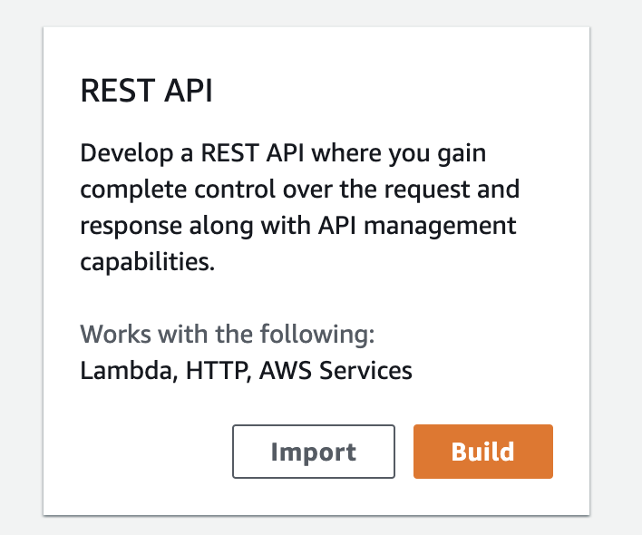
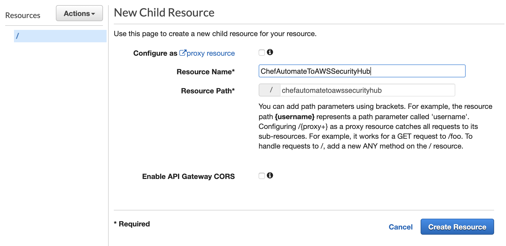
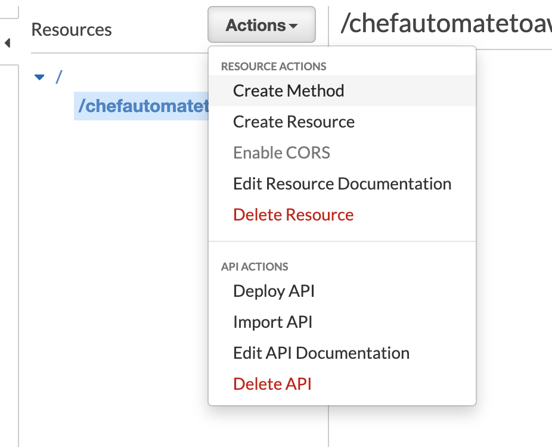
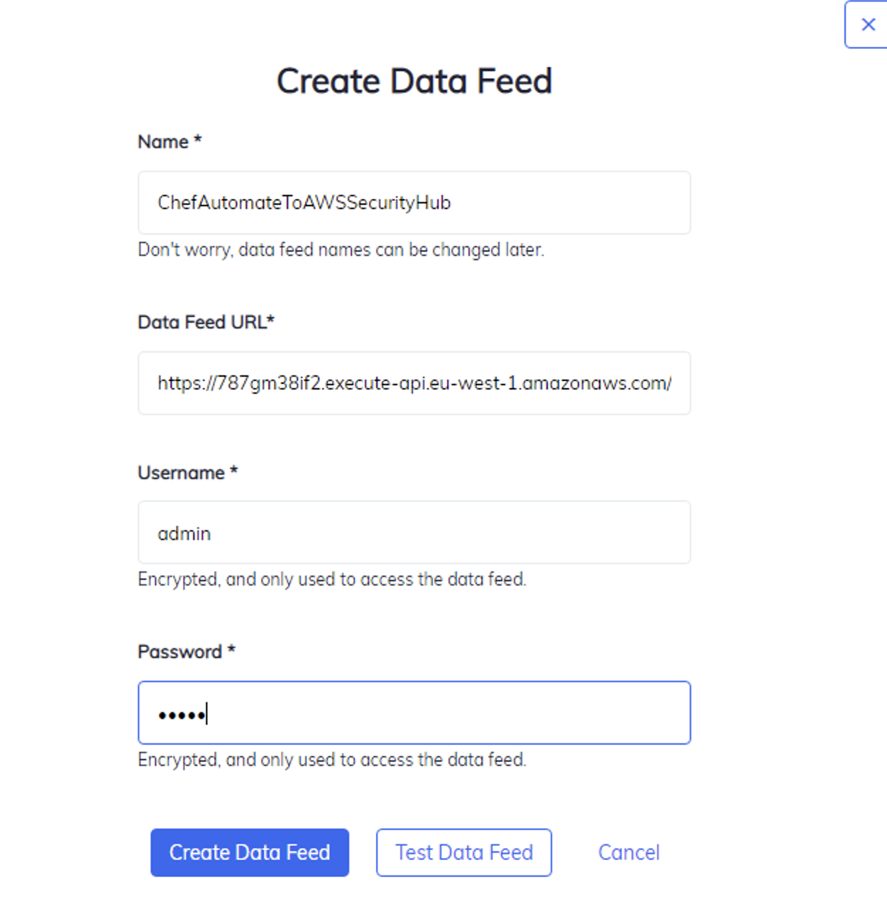

# AwsSecurityHubAutomateIntegration

An AWS Lambda function that sends data received from Chef Automate Data Tap to AWS Security Hub

## Basic flow
1. Create an AWS Lambda function with [lambda_function.rb](lambda_function.rb) to process Chef Infrastructure and Compliance Data and send it to the AWS Security Hub in the required [ASFF](https://docs.aws.amazon.com/securityhub/latest/userguide/securityhub-findings-format.html) format.<br />
2. Set up an IAM role to allow the Lambda to call SecurityHub functions.
3. Create an AWS API Gateway and Resouce/Method so we can call the Lambda function over HTTPS
4. Add the AWS API Gateway URL to a Chef Automate Data Tap
5. View the Chef Infrastructure and Compliance Data in the AWS Security Hub

## Creating the empty Lambda function
Open the AWS Lambda console
* select create function - author from scratch
* Fill out the details as shown and click save

<br />

## Adding the Lambda code
* Scroll down your lambda definition until you find the `function code` section
* Add the code from ([lambda_function.rb](lambda_function.rb)) in the code editor as shown
<br />

## Adding the IAM role/policy to the Lambda function
* Add a Policy to the Lambda's role to allow logging and reporting findings to the AWS Security Hub.
* Select the `Permissions` tab and click the existing link under `role name`.

* Click `Attach policies` Button, then `Create policy`
<br />
* Add this policy using the json editor
```
{
  "Version": "2012-10-17",
  "Statement": [
     {
       "Effect": "Allow",
       "Action": [
         "logs:CreateLogStream",
         "logs:CreateLogGroup",
         "logs:PutLogEvents",
         "securityhub:UpdateFindings",
         "securityhub:BatchUpdateFindings",
         "securityhub:BatchImportFindings"
       ],
       "Resource": "*"
     }
   ]
}
```
Click `Review policy`<br />
Click `Create policy`<br />
<br />
Search for your newly created policy attach it to your role<br />
<br />

## Creating an AWS API Gateway Configuration

i. Create new API Gateway
<br />
Select a `Rest API` and `build`.<br />
<br />
Configure as shown below and click `Create API`<br />
<br />
Select `Actions`, then Create Resource as below, click `Create Resource`<br />
<br />
With the resource selected create a new method, select `ANY` and then tick the tick, as below:<br />
<br />
Fill in the Lambda details and hit save:<br />
<br />
Say Ok to allow the gateway to have the permission to call your Lambda function.<br />

Test your method if you want, you will see an error from the Lambda code, that is expected as there is no input data to work on, we will supply that later.<br />

Deploy your new API:<br />


Create a new Deploy stage:<br />

Call it `dev` and hit `Deploy`


Select your stage and your resource and any of the methods (we choose to support ANY method to call our Lambda function in our setup).
You can see the URL required to invoke the API, make a copy ot it.


3. Create a Data Tap in Chef Automate

i. Open your browser up and go to Chef Automate and select the `settings` tab -> `Data Feeds`. (If the menu item is not there then you may be using the beta version, type `beta` in the browser window and turn the Data Feed on, refresh the browser).


ii. Click `Create Data Feed` and fill in as below. You can put random stuff in the `Username` and `Password` fields, the Lambda function could be extended in the future to use them.
Click `Create Data Feed`


iii. Test your data feed, you should get a postive reply if all is set up properly

iv. Speed up the data interval and adjust the amount of node data sent.<br />
ssh on to your Chef Automate machine and alter the config of the data feed. <br />
Edit `/hab/pkgs/chef/data-feed-service/1.0.0/20200506151626/default.toml.`<br />
Your version numbers may be different. Speed up the `feed_interval` and change the `node_batch_size` to 3
```
[service]
host = "localhost"
port = 14001
feed_interval = "3m"
asset_page_size = 100
reports_page_size = 1000
node_batch_size = 3
updated_nodes_only = false
disable_cidr_filter = true
cidr_filter = "0.0.0.0/0"

[tls]
key_contents =""
cert_contents = ""
root_cert_contents = ""

[mlsa]
accept = false

[log]
format = "text"
level = "info"

[storage]
database = "data_feed_service"
```
Stop the data_feed service (it will auto restart)<br />
`hab svc stop chef/data-feed-service`<br />
`hab svc status`<br />
Note in future versios of Chef Automate you will be able to adust the Chef Automate config to set this.

4. View the Chef Infrastructure and Compliance data in the AWS Security hub. Add a filter on `Generator ID` of `Inspec` as shown below:

